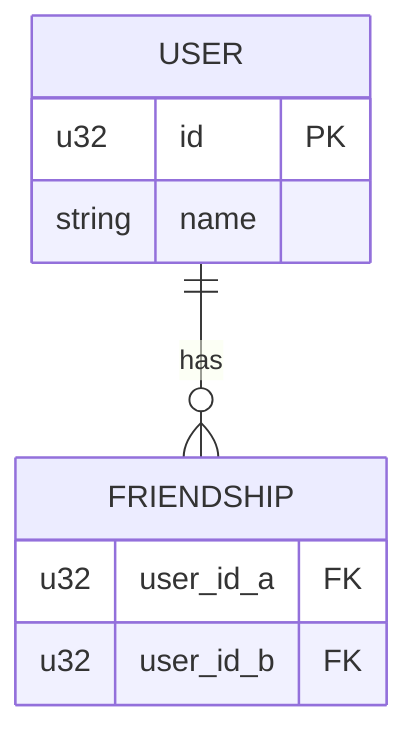
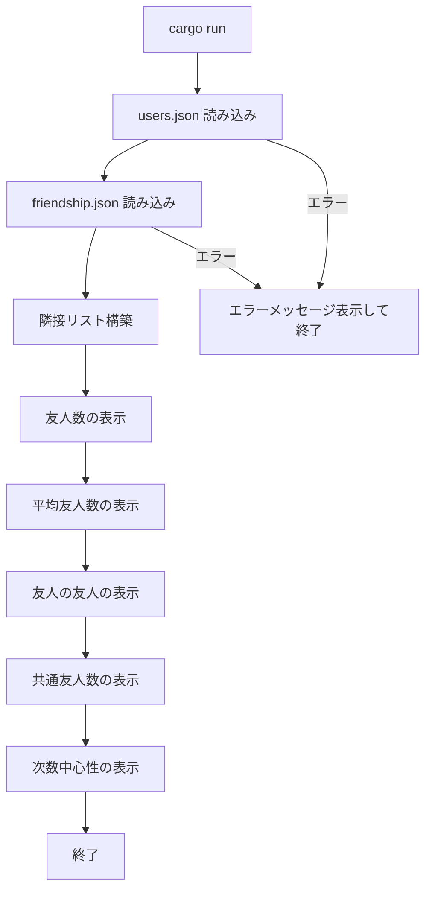

# 機能設計書

## システム構成図

```
┌─────────────────────────────────────────────┐
│                  CLI (cargo run)             │
└─────────────────────┬───────────────────────┘
                      │
                      ▼
┌─────────────────────────────────────────────┐
│                  main.rs                     │
│  - データ読み込み                            │
│  - 各統計処理の呼び出し                      │
│  - 結果の標準出力                            │
└──────┬──────────────┬───────────────────────┘
       │              │
       ▼              ▼
┌────────────┐  ┌─────────────────────────────┐
│ data/      │  │ src/                         │
│ users.json │  │  network.rs - ネットワーク   │
│ friendship │  │  stats.rs   - 統計算出       │
│ .json      │  └─────────────────────────────┘
└────────────┘
```

## データモデル定義

### ER図



### データ構造（Rust）

```rust
// ユーザー
struct User {
    id: u32,
    name: String,
}

// 交友関係（隣接リスト）
// HashMap<u32, Vec<u32>>
// key: ユーザーID, value: 友人IDのリスト
type FriendMap = HashMap<u32, Vec<u32>>;
```

### JSONスキーマ

**users.json**
```json
[
  { "id": 0, "name": "Hero" }
]
```

**friendship.json**
```json
{
  "pairs": [
    { "pair": [0, 1] }
  ]
}
```

## コンポーネント設計

### モジュール構成

| モジュール | ファイル | 責務 |
|-----------|---------|------|
| main | `src/main.rs` | エントリポイント、出力制御 |
| models | `src/models.rs` | データ構造の定義 |
| loader | `src/loader.rs` | JSONファイルの読み込み・パース |
| network | `src/network.rs` | 隣接リスト構築・ネットワーク操作 |
| stats | `src/stats.rs` | 統計量の算出 |

### 各モジュールの関数

#### loader.rs
```
load_users(path: &str) -> Vec<User>
  JSONファイルを読み込んでUserのVecを返す

load_friendships(path: &str) -> FriendMap
  JSONファイルを読み込んで隣接リスト(FriendMap)を返す
```

#### network.rs
```
build_friend_map(users: &[User], pairs: &[(u32, u32)]) -> FriendMap
  ペアリストから双方向の隣接リストを構築する

friends_of_friends(user_id: u32, friend_map: &FriendMap) -> Vec<u32>
  2ホップ以内のユーザーIDリストを返す（自身・直接友人を除く・重複なし）
```

#### stats.rs
```
number_of_friends(user_id: u32, friend_map: &FriendMap) -> usize
  指定ユーザーの友人数を返す

average_number_of_friends(friend_map: &FriendMap) -> f64
  全ユーザーの平均友人数を返す

common_friends(user_id_a: u32, user_id_b: u32, friend_map: &FriendMap) -> usize
  2ユーザー間の共通友人数を返す

degree_centrality(user_id: u32, friend_map: &FriendMap, total_users: usize) -> f64
  次数中心性 = 友人数 / (全ユーザー数 - 1) を返す
```

## ユースケース

### UC-01: 友人数の表示

```
1. users.json を読み込む
2. friendship.json を読み込む
3. 隣接リストを構築する
4. 各ユーザーについて number_of_friends() を呼び出す
5. "ユーザー名: N人" の形式で出力する
```

### UC-02: 平均友人数の表示

```
1. 隣接リスト構築済みを前提とする
2. average_number_of_friends() を呼び出す
3. "平均友人数: X.XX" の形式で出力する
```

### UC-03: 友人の友人の表示

```
1. 各ユーザーについて friends_of_friends() を呼び出す
2. "ユーザー名の友人の友人: [名前, ...]" の形式で出力する
```

### UC-04: 共通友人数の表示

```
1. 全ユーザーペアについて common_friends() を呼び出す
2. "ユーザーA & ユーザーB: N人の共通友人" の形式で出力する
```

### UC-05: 次数中心性の表示

```
1. 各ユーザーについて degree_centrality() を呼び出す
2. "ユーザー名: 0.XX" の形式で出力する
```

## 画面/状態遷移

本アプリケーションはCLIのため画面遷移なし。実行フローは以下の通り。



## 出力フォーマット例

```
=== 友人数 ===
Hero: 2人
Dunn: 3人
...

=== 平均友人数 ===
平均友人数: 2.40

=== 友人の友人 ===
Hero の友人の友人: [Chi]
...

=== 共通友人数 ===
Hero & Chi: 2人の共通友人
...

=== 次数中心性 ===
Hero: 0.222
Dunn: 0.333
...
```
