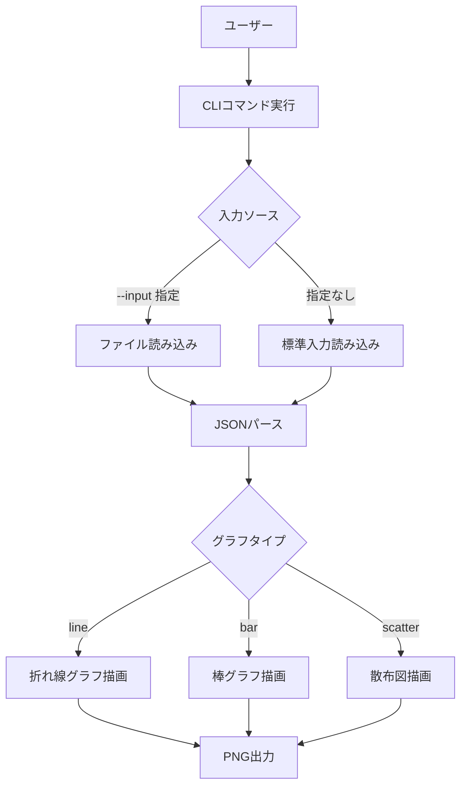

# 機能設計書

## システム構成図

```
┌────────────────────────────────────────────────┐
│                   graph-image CLI               │
│                                                │
│  ┌──────────┐   ┌──────────┐   ┌────────────┐ │
│  │  Input   │──▶│  Parser  │──▶│  Renderer  │ │
│  │ (JSON)   │   │          │   │            │ │
│  └──────────┘   └──────────┘   └─────┬──────┘ │
│                                      │        │
│                                      ▼        │
│                               ┌────────────┐  │
│                               │   Output   │  │
│                               │ (PNG file) │  │
│                               └────────────┘  │
└────────────────────────────────────────────────┘
```

## コンポーネント設計

### main

- CLIオプションのパース
- 入力ソース（ファイル / 標準入力）の選択
- グラフタイプに応じた Renderer の呼び出し

### InputReader

- `--input` が指定された場合: ファイルを読み込む
- 指定なしの場合: 標準入力から読み込む
- JSON文字列を返す

### JsonParser

- JSON文字列を受け取り、グラフタイプに対応するデータ構造に変換する

### Renderer

グラフタイプごとに実装:

| モジュール | グラフタイプ |
|---|---|
| `LineRenderer` | 折れ線グラフ |
| `BarRenderer` | 棒グラフ |
| `ScatterRenderer` | 散布図 |

各Rendererは共通の `Renderer` トレイトを実装する:

```rust
trait Renderer {
    fn render(&self, output_path: &str, width: u32, height: u32) -> Result<(), RenderError>;
}
```

### OutputWriter

- 出力先ディレクトリが存在しない場合は作成する
- PNG画像をファイルに書き出す

## データモデル定義

### 折れ線グラフ (line)

```json
{
  "title": "グラフタイトル（省略可）",
  "x_label": "X軸ラベル（省略可）",
  "y_label": "Y軸ラベル（省略可）",
  "series": [
    {
      "label": "系列名（省略可）",
      "data": [
        {"x": 1.0, "y": 2.0},
        {"x": 2.0, "y": 4.0}
      ]
    }
  ]
}
```

### 棒グラフ (bar)

```json
{
  "title": "グラフタイトル（省略可）",
  "x_label": "X軸ラベル（省略可）",
  "y_label": "Y軸ラベル（省略可）",
  "categories": ["A", "B", "C"],
  "series": [
    {
      "label": "系列名（省略可）",
      "data": [10.0, 25.0, 15.0]
    }
  ]
}
```

### 散布図 (scatter)

```json
{
  "title": "グラフタイトル（省略可）",
  "x_label": "X軸ラベル（省略可）",
  "y_label": "Y軸ラベル（省略可）",
  "series": [
    {
      "label": "系列名（省略可）",
      "data": [
        {"x": 1.0, "y": 2.0},
        {"x": 3.0, "y": 5.0}
      ]
    }
  ]
}
```

## ユースケース



## 画面（出力画像）仕様

- 形式: PNG
- サイズ: `--size` で指定された値 × 同値（正方形）、デフォルト 256×256
- 背景: 白
- グラフ要素:
  - タイトル（データに含まれる場合）
  - 軸ラベル（データに含まれる場合）
  - 凡例（複数系列の場合）
  - グリッドライン

## エラー処理

| エラー種別 | 対処 |
|---|---|
| 入力ファイルが存在しない | stderrにメッセージ出力、exit code 1 |
| JSONパースエラー | stderrにメッセージ出力、exit code 1 |
| 不正なグラフタイプ | stderrにメッセージ出力、exit code 1 |
| 出力先書き込みエラー | stderrにメッセージ出力、exit code 1 |
