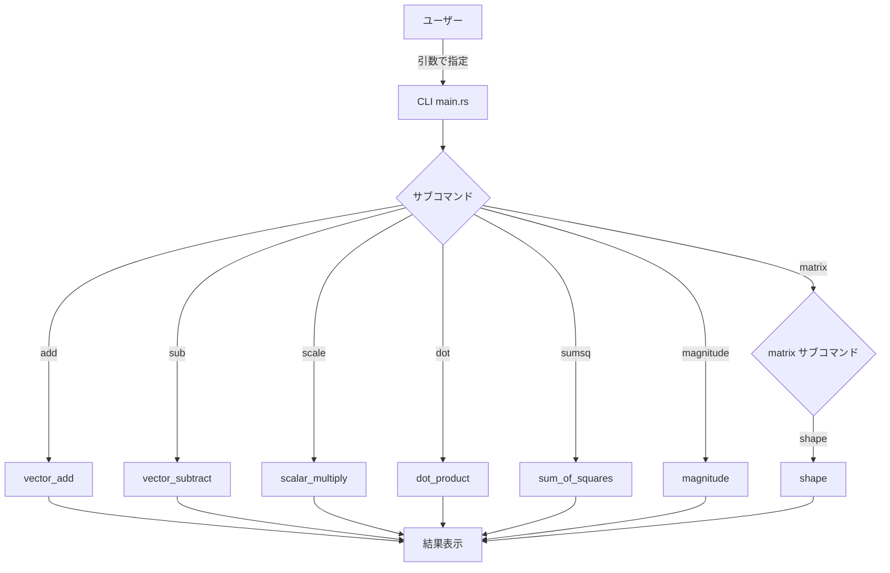

# 機能設計書

## アーキテクチャ概要

```
┌─────────────────────────────────┐
│           CLI (main.rs)         │
│  引数受け取り / 結果表示         │
└────────────┬──────────┬─────────┘
             │          │
┌────────────▼───┐ ┌────▼────────────┐
│  vector.rs     │ │  matrix.rs      │
│  ベクトル演算  │ │  行列演算       │
└────────────────┘ └─────────────────┘
```

## コンポーネント設計

### `src/vector.rs` — ベクトル演算モジュール

各関数は純粋関数として実装する。副作用なし。

| 関数名 | シグネチャ | 説明 |
|--------|-----------|------|
| `vector_add` | `(v1: &[f64], v2: &[f64]) -> Result<Vec<f64>, String>` | ベクトル加算 |
| `vector_subtract` | `(v1: &[f64], v2: &[f64]) -> Result<Vec<f64>, String>` | ベクトル減算 |
| `scalar_multiply` | `(scalar: f64, v: &[f64]) -> Vec<f64>` | スカラー乗算 |
| `dot_product` | `(v1: &[f64], v2: &[f64]) -> Result<f64, String>` | 内積 |
| `sum_of_squares` | `(v: &[f64]) -> f64` | 二乗和 |
| `magnitude` | `(v: &[f64]) -> f64` | マグニチュード（ユークリッドノルム） |

### `src/matrix.rs` — 行列演算モジュール

各関数は純粋関数として実装する。副作用なし。

| 関数名 | シグネチャ | 説明 |
|--------|-----------|------|
| `shape` | `(matrix: &[Vec<f64>]) -> Result<(usize, usize), String>` | 行列の shape（行数, 列数）を返す |

### `src/main.rs` — エントリーポイント

- サブコマンド形式でCLIを提供
- 各演算をサブコマンドとして呼び出す
- `matrix` はさらにサブコマンドを持つ

## データモデル

ベクトルはRustの `Vec<f64>` または `&[f64]` スライスで表現する。

```
Vector = Vec<f64>
例: [1.0, 2.0, 3.0]
```

行列はRustの `Vec<Vec<f64>>` で表現する。各内側 `Vec<f64>` が1行を表す。

```
Matrix = Vec<Vec<f64>>
例: [[1.0, 2.0, 3.0], [4.0, 5.0, 6.0]]  → 2行3列
```

## ユースケース



## 演算の定義

### ベクトル加算 / 減算

```
v1 = [a1, a2, ..., an]
v2 = [b1, b2, ..., bn]
add: [a1+b1, a2+b2, ..., an+bn]
sub: [a1-b1, a2-b2, ..., an-bn]
制約: len(v1) == len(v2)
```

### スカラー乗算

```
c = スカラー値
v = [a1, a2, ..., an]
result: [c*a1, c*a2, ..., c*an]
```

### 内積（ドット積）

```
v1 = [a1, a2, ..., an]
v2 = [b1, b2, ..., bn]
result: a1*b1 + a2*b2 + ... + an*bn
制約: len(v1) == len(v2)
```

### 二乗和

```
v = [a1, a2, ..., an]
result: a1^2 + a2^2 + ... + an^2
```

### マグニチュード

```
v = [a1, a2, ..., an]
result: sqrt(a1^2 + a2^2 + ... + an^2)
```

## エラーハンドリング

| ケース | エラーメッセージ |
|--------|----------------|
| ベクトル次元不一致 | `"vectors must have the same length"` |
| 行列の列数不一致 | `"all rows must have the same number of columns"` |

## CLIインターフェース

```
# ベクトル加算
$ cargo run -- add 1,2,3 4,5,6
[5, 7, 9]

# ベクトル減算
$ cargo run -- sub 5,7,9 4,5,6
[1, 2, 3]

# スカラー乗算
$ cargo run -- scale 2 1,2,3
[2, 4, 6]

# 内積
$ cargo run -- dot 1,2,3 4,5,6
32

# 二乗和
$ cargo run -- sumsq 1,2,3
14

# マグニチュード
$ cargo run -- magnitude 3,4
5

# 行列 shape
$ cargo run -- matrix shape "1,2,3;4,5,6"
(2, 3)
```
