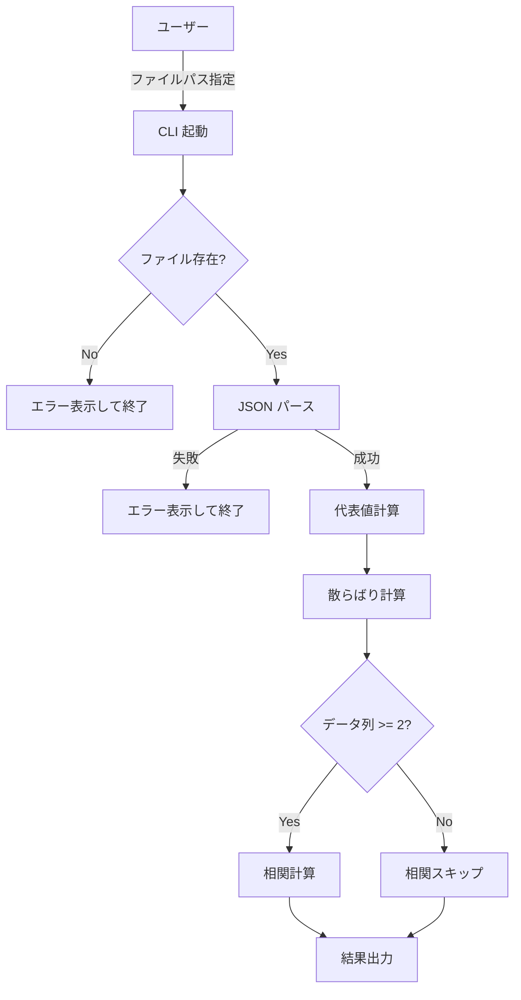

# 機能設計書

## システム構成図

```
┌──────────────────────────────────────────┐
│  CLI エントリポイント (main.rs)           │
│  - 引数解析                              │
│  - JSON 読み込み                         │
│  - 結果出力                              │
└──────────────┬───────────────────────────┘
               │
       ┌───────┴────────┐
       ▼                ▼
┌─────────────┐  ┌─────────────────┐
│ statistics  │  │  correlation    │
│ モジュール  │  │  モジュール     │
│ (代表値・   │  │  (共分散・      │
│  散らばり)  │  │   相関係数)     │
└─────────────┘  └─────────────────┘
```

## データモデル定義

### 入力 JSON

```json
{
  "datas": [
    [f64, ...],  // datas[0]: 主データ列
    [f64, ...]   // datas[1]: 副データ列（相関計算用）
  ]
}
```

### Rust 構造体

```rust
#[derive(Deserialize)]
struct Input {
    datas: Vec<Vec<f64>>,
}
```

### 計算結果

```rust
struct CentralTendency {
    mean: f64,
    median: f64,
    quantile_25: f64,
    quantile_75: f64,
    mode: f64,
}

struct Dispersion {
    range: f64,
    variance: f64,
    std_dev: f64,
}

struct CorrelationResult {
    covariance: f64,
    correlation: f64,
}
```

## コンポーネント設計

### main.rs

- コマンドライン引数からファイルパスを受け取る
- ファイル読み込み → JSON パース → 各モジュールに委譲 → 結果表示

### statistics モジュール (src/statistics.rs)

| 関数 | シグネチャ | 説明 |
|------|-----------|------|
| `mean` | `fn mean(data: &[f64]) -> f64` | 算術平均 |
| `median` | `fn median(data: &[f64]) -> f64` | 中央値（ソート済みを仮定しない） |
| `quantile` | `fn quantile(data: &[f64], p: f64) -> f64` | p 分位数（0.0〜1.0） |
| `mode` | `fn mode(data: &[f64]) -> f64` | 最頻値（整数値相当の頻度で判定） |
| `data_range` | `fn data_range(data: &[f64]) -> f64` | 最大値 − 最小値 |
| `variance` | `fn variance(data: &[f64]) -> f64` | 不偏分散 |
| `std_deviation` | `fn std_deviation(data: &[f64]) -> f64` | 標準偏差 |

### correlation モジュール (src/correlation.rs)

| 関数 | シグネチャ | 説明 |
|------|-----------|------|
| `covariance` | `fn covariance(x: &[f64], y: &[f64]) -> f64` | 標本共分散 |
| `correlation` | `fn correlation(x: &[f64], y: &[f64]) -> f64` | ピアソン相関係数 |

## アルゴリズム定義

### 平均値

$$\bar{x} = \frac{1}{n}\sum_{i=1}^{n} x_i$$

### 中央値

- ソート後、n が奇数なら中央要素、偶数なら中央2要素の平均

### 分位数（線形補間なし・インデックス法）

```
index = floor(p * n)
quantile = sorted[index]
```

### 最頻値

- `i64` にキャストした値の出現頻度をカウントし最大頻度の値を返す

### 分散（不偏）

$$s^2 = \frac{1}{n-1}\sum_{i=1}^{n}(x_i - \bar{x})^2$$

### 標準偏差

$$s = \sqrt{s^2}$$

### 共分散

$$S_{xy} = \frac{1}{n-1}\sum_{i=1}^{n}(x_i - \bar{x})(y_i - \bar{y})$$

### 相関係数

$$r = \frac{S_{xy}}{s_x \cdot s_y}$$

## ユースケース


